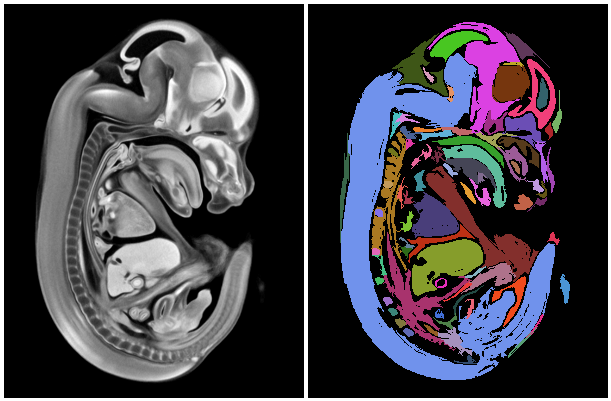

# Image segmentation using DBSCAN clustering algorithm.

This is an adaptation of the general DBSCAN algorithm for image
segmentation. Even though the demonstration uses 2D embryo
section image, the algorithm is applicable to 3D voxels. All we need
to change is the way the epsilon neighbours are selected. For the 2D
image, there are eight adjacent pixel neighbours; whereas, a 3D voxel
has 26 adjacent voxel neighbours. The rest of the algorithm need not
change.

## Usage

        $ cd imageseg
        $ python -m SimpleHTTPServer

Visit the web-site, and move the mouse cursor over the image on the
right. This will select the DBSCAN parameters `epsilon` and `minpts`
and render the clusters using different colours.
